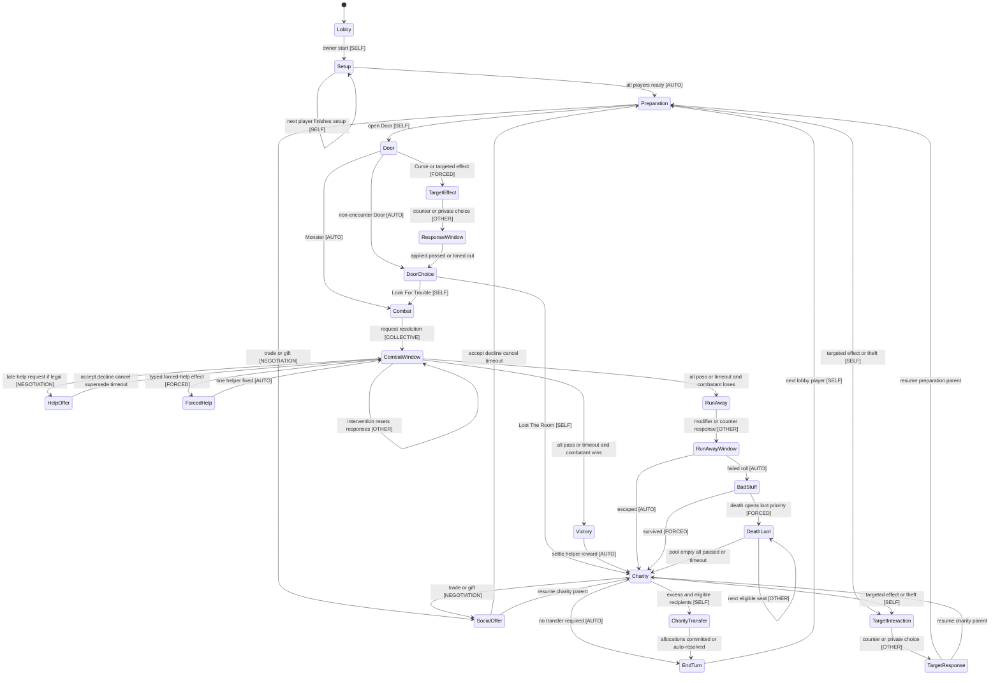
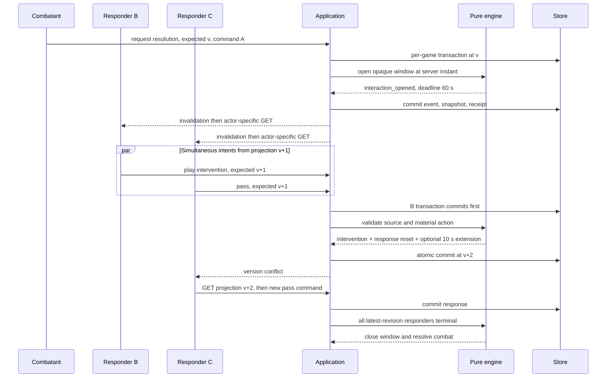
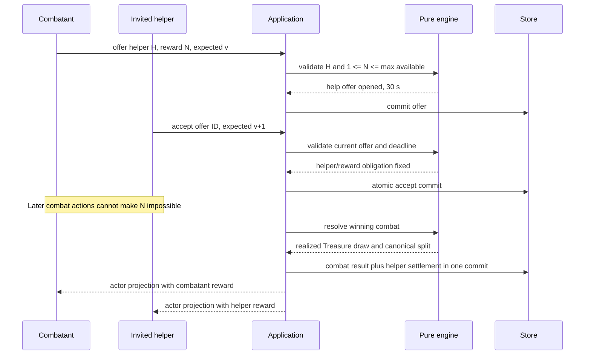
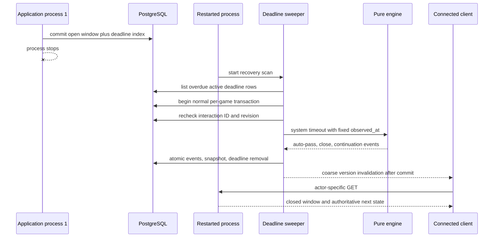

# Multiplayer interaction protocol

- **Статус:** normative design, runtime не реализован
- **Дата:** 2026-07-30
- **Решение:** ADR-0008
- **Область:** future multiplayer profile поверх `first-edition-core-v1`

## Как читать документ

Этот документ задаёт будущий server-authoritative protocol многосторонних
игровых взаимодействий. Он является входом для отдельных implementation plans,
но не доказывает наличие новых Go commands, migrations, HTTP/Zod contracts,
workers, Vue surfaces или активированного `other_players` content.

Текущий runtime, schema, migrations и tests остаются источниками истины о том,
что уже работает. ADR-0002 и ADR-0004 остаются обязательными: backend выбирает
actor и outcome, replay не читает clock/RNG, projection не раскрывает чужую
руку, realtime передаёт только invalidation.

Термины в квадратных скобках помечают тип участия:

- `[SELF]` — выбор current actor;
- `[OTHER]` — ответ другого actor;
- `[COLLECTIVE]` — ответы нескольких actors;
- `[NEGOTIATION]` — offer/accept/decline;
- `[FORCED]` — обязательный выбор или server outcome;
- `[AUTO]` — deterministic transition без ожидания клиента.

## Подтверждённая runtime-граница

На дату документа runtime поддерживает lobby из 1–6 участников, но не
поддерживает multiplayer interaction windows.

| Уже реализовано | Ещё не реализовано |
|---|---|
| Один active actor и один full turn reducer | Несколько eligible actors |
| `ActionWindow` без ID/deadline | Stable interaction ID, responses, close reason |
| `PendingDecision` только current actor | Чужие/collective/private decisions |
| Own one-shots/abilities в своём бою | Help, reward, intervention, pass |
| Self-discard charity | Charity transfer |
| Death сразу discard-ит lootable zones | Death-loot priority |
| Exact version + idempotency receipt | System timeout command/receipt |
| Atomic events/snapshot/receipt | Persisted deadline index и sweeper |
| Actor-specific projection | Actor-specific interaction descriptors |
| Version-only SSE с command reason | Privacy-coarse interaction invalidation |

`State.Validate` сейчас требует ровно одного eligible actor, а
`requireActiveActor` отклоняет команду любого другого участника. Definitions с
`interaction_scope: other_players` валидируются, но не materialize-ятся. Эти
ограничения меняются только будущими code/content plans.

## Нормативные инварианты

1. Actor берётся только из server-validated credential. `actor_id`,
   `eligible_actor_ids`, RNG, deadline и close reason не выбираются клиентом.
2. Pure engine принимает state и typed intent. Он не читает clock, network,
   database, presence, env или global RNG.
3. Каждый принятый action, realized random outcome, extension, timeout,
   auto-pass и terminal close reason сохраняется в domain events.
4. Replay применяет события и не сравнивает deadline с текущим временем.
5. Player/system transition использует normal per-game transaction и exact
   version CAS. Одновременные ответы не обходят эту границу.
6. Internal window/state никогда не сериализуется напрямую. Каждый actor
   получает allowlisted projection и только свои legal descriptors/options.
7. Отсутствие descriptor в UI не является rule enforcement. Backend повторно
   проверяет intent по current state, window ID, version и deadline.
8. Realtime остаётся version-only invalidation. Reconnect всегда делает fresh
   actor-specific `GET`.
9. Content исполняется только closed typed registry. `rules_text`, client
   flags и произвольные expressions не становятся predicates.
10. Одновременно принят только один helper. Принятая reward obligation
    исполняется сервером и не остаётся UI-договорённостью.

## End-to-end state graph

Граф показывает target protocol. Interaction window является overlay над
parent phase, а не доказательством новых runtime phases.



Targetable Curse/effect, theft и forced help могут открываться только из
разрешённой parent phase. Они используют тот же window kernel, но не создают
свободный глобальный interrupt в любой момент.

## Phase interaction matrix

| Phase / capability | Initiator | Eligible actors | Legal intents / targets | Projection | Response | Close condition | Timeout | Next state |
|---|---|---|---|---|---|---|---|---|
| Lobby join/start | joiner или owner | joiner; owner для start | join с token; start при public player count | Public lobby summary; credential только actor | Optional join; owner start | Start committed | Нет interaction timer | Setup |
| Setup | current setup actor | один actor | Server-supplied own management + `finish_setup` | Own hand/options; другим только setup status/counts | `finish_setup` mandatory | Actor finishes; затем следующий | General AFK policy вне v1 | Setup либо Preparation |
| Preparation | active actor | active actor | Own management, sell, open Door; разрешённый social offer | Own descriptors; public board | Open Door mandatory для progression | Door opened | General turn timer вне v1 | Door |
| Door reveal | server | active actor для private effect | Realized top card; typed self/target effect | Card становится public только по rule; private choices actor-only | Forced where effect requires | Effect resolved либо deterministic skip | 30 s для mandatory choice | DoorChoice / Combat |
| Door choice | active actor | active actor | Own Monster или Loot Room | Own Monster IDs не видны другим до play | Mandatory branch | One branch committed | General turn timer вне v1 | Combat / Charity |
| Combat preparation | combatant | combatant | Own actions и request resolution | Public totals; own cards private | No other-player response yet | Resolution request opens collective window | General turn timer вне v1 | CombatWindow |
| Combat response | combatant requests | public set всех живых non-combatants; actor descriptors private | Pass, legal intervention, allowed targets, one bounded help offer child | Coarse public window; own sources/options only | Optional response; pass explicit | All pending terminal after latest material revision | 60 s; pending actors auto-pass | Victory / RunAway |
| Help negotiation | combatant | один invited helper | Accept/decline; combatant cancel/supersede before accept | Exact offer только parties; public summary без private options | Helper optional | Accepted, declined, cancelled, superseded, expired | 30 s, clamped parent deadline | Resume parent CombatWindow |
| Combat settlement | server | fixed combatant + at most one helper | No client allocation | Public outcome; reward cards private owners | Forced | Rewards/levels/obligation atomically settled | Нет | Finished / Charity |
| Run Away | required escaping actor | escaping actor; optional opaque responders | Server roll intent; response modifiers/counters | Public attempt/outcome; own hidden response only | Roll mandatory; modifiers optional | Response closed, then realized roll | 30 s; system rolls or responders auto-pass | Charity / BadStuff |
| Bad Stuff / target effect | effect initiator/server | target и opaque responders по typed effect | Allowed target, counter, bounded private choice | Target sees own options; others see coarse lifecycle | По effect mandatory/optional | Effect applied/cancelled | 30 s; typed deterministic default | Parent continuation |
| Trade/gift | offering actor | один recipient | Server-valid offered public/explicit cards; accept/decline | Exact offer только parties до commit | Recipient optional | Accept, decline, cancel, expiry | 30 s = decline | Parent phase |
| Charity transfer | active actor | active actor; recipients server-derived | Exact excess own cards + lowest-level recipients | Allocator/recipient private card IDs; public counts | Allocation mandatory | Exact excess allocated/discarded | 30 s deterministic auto-allocation | EndTurn |
| Theft | actor with typed capability | chosen target; opaque counter responders | Public legal target; server RNG/private target choice where declared | No victim hand scan in public projection | Target response only if effect declares it | Attempt resolved/countered | 30 s; response auto-pass, RNG persisted | Parent phase |
| Death loot | death event | surviving players in stable seat priority | Current priority actor chooses one server-exposed loot option or pass | Options только current looter; others count/public result | Optional per seat | Pool empty или every seat terminal | 30 s per seat = auto-pass | Charity / parent |
| End turn | active actor | active actor | `end_turn` after no blocking window | Public next actor | Mandatory progression | Commit advances seat | General AFK policy вне v1 | Preparation |
| Disconnect/reconnect | transport event, не game intent | same actors remain eligible | No immediate pass; reconnect GET; normal intents if before deadline | Fresh actor-specific state, same window ID/deadline | Pending until explicit response/deadline | Existing close rules | Deadline auto-pass/auto-outcome | Determined by window |

Обычный turn-owner inactivity вне interaction window не решается этим
протоколом. Future lobby AFK/kick policy требует отдельного plan; она не должна
маскироваться под transport disconnect.

## Formal `InteractionWindow`

Ниже design shape, а не текущий Go/JSON contract:

```json
{
  "interaction_id": "int_opaque",
  "kind": "combat_response",
  "parent": {
    "phase": "combat",
    "subject_kind": "encounter",
    "subject_id": "encounter_opaque",
    "parent_interaction_id": null
  },
  "initiator_actor_id": "player_internal",
  "eligible_actor_ids": ["player_internal"],
  "allowed_intents": ["pass", "play_intervention"],
  "eligibility_policy": "opaque_public_set",
  "visibility_policy": "actor_specific",
  "opened_at": "server UTC instant",
  "deadline_at": "server UTC instant",
  "deadline_revision": 1,
  "base_duration_seconds": 60,
  "late_threshold_seconds": 30,
  "extension_budget_seconds": 30,
  "responses": {
    "player_internal": {
      "state": "pending",
      "accepted_command_id": null
    }
  },
  "status": "open",
  "close_reason": null
}
```

### Field contract

| Field | Rule |
|---|---|
| `interaction_id` | Server-generated opaque stable ID, persisted in open event; client never chooses it |
| `kind` | Closed enum tied to typed rules/effect registry |
| `parent` | Parent phase, public/opaque subject and optional parent window; changing subject invalidates window |
| `initiator_actor_id` | Internal actor or system; projected only when rules make initiator public |
| `eligible_actor_ids` | Internal authoritative set; never copied wholesale into every projection |
| `allowed_intents` | Intent kinds, not global card IDs or arbitrary payload schema |
| `eligibility_policy` | `public_predicate`, `actor_private` or `opaque_public_set` |
| `visibility_policy` | Allowlists common summary and actor-private fields |
| `opened_at` | Fixed server instant supplied by application and stored in event |
| `deadline_at` | Absolute authoritative instant; not a client duration |
| `deadline_revision` | Increments whenever material transition replaces deadline |
| `base_duration_seconds` | 60 for collective combat; 30 for addressed/private/priority windows |
| `late_threshold_seconds` | 30 for collective combat; absent for non-extendable windows |
| `extension_budget_seconds` | Remaining bounded budget; starts at 30 for combat |
| `responses` | Internal per-actor state; projection exposes only actor’s own state or safe aggregate |
| `status` | `open`, `closed` |
| `close_reason` | Stable terminal enum persisted with close event |

Response state is a closed enum:

```text
pending | passed | acted | accepted | declined | timed_out | auto_resolved
```

Terminal close reasons:

```text
all_responded
accepted
declined
cancelled
superseded
deadline_expired
auto_skipped_no_public_action
subject_invalidated
parent_closed
game_finished
```

Old windows remain in append-only events/history. Current state хранит только
необходимые open windows и stable outcome/obligation.

## Deterministic legal-action predicate

Для каждого kind существует pure predicate:

```text
Legal(state, window, actor, typed_intent, content_registry) -> bool
```

Он обязан проверить:

1. window open, ID/kind/parent subject совпадают;
2. actor входит во внутренний eligible set;
3. intent kind зарегистрирован для window;
4. source/target/options принадлежат server-computed actor descriptor;
5. phase, ownership, content capability и current response state допустимы;
6. reward/cardinality/target restrictions выполняются;
7. intent не пытается продлить/закрыть window клиентским флагом.

Application sample-ит `Clock.Now()` ровно один раз внутри per-game
`WithinGame` callback, после чтения/lock current state. Этот `accepted_at`
используется и для expiry predicate, и в persisted event; pre-lock HTTP
arrival time не даёт право принять late action. Engine получает fixed value
либо typed timeout intent. RNG вызывается только внутри command handling, и
realized result попадает в event.

`HasLegalAction(state, window, actor)` использует тот же registry. Отдельный
client scan запрещён.

### Empty-window и timing policy

| Policy | Когда | Поведение |
|---|---|---|
| `public_predicate` | Наличие action полностью выводится из уже public state | Если legal action нет ни у кого, window/timer не создаётся; пишется explicit auto-skip event |
| `actor_private` | Choice касается только actor’s own hidden state и публично не перечисляет options | Actor получает private descriptor; public projection видит только coarse parent progress |
| `opaque_public_set` | Сам факт наличия карты/контрдействия в чужой руке чувствителен | Window всегда открывается для public-derived actor set; actor без action видит только `pass` |

Для opaque window server не выполняет public immediate skip после hidden-hand
scan. Все actors остаются `pending`, пока явно не ответят или не истечёт
deadline. Раннее закрытие после явных passes является наблюдаемым выбором
игроков, но не server oracle о содержимом рук. Projection не показывает, у
кого был только `pass`.

Public auto-skip event сообщает только aggregate
`no_public_legal_action`, без actor/card/reason. Для private/opaque kinds такой
reason не публикуется.

## Server-authoritative timer policy

### Durations

| Window class | Base | Late threshold | Extension | Hard cap |
|---|---:|---:|---:|---:|
| Collective combat response | 60 s | 30 s от `opened_at` | +10 s за committed material intervention | 90 s от `opened_at` |
| Addressed help/trade/gift offer | 30 s | — | нет | 30 s |
| Target/private/forced choice | 30 s | — | нет | 30 s |
| Run Away response | 30 s | — | нет | 30 s |
| Death-loot priority seat | 30 s | — | нет | 30 s |

Для collective combat:

```text
if committed_material_action
   and accepted_at >= opened_at + 30s
   and extension_budget_seconds >= 10:
    deadline_at = min(deadline_at + 10s, opened_at + 90s)
    extension_budget_seconds -= actual_added_seconds
    deadline_revision += 1
```

Material allowlist:

- accepted combat one-shot/modifier/counter;
- accepted additional Monster/enhancer;
- accepted helper, forced helper или изменение fixed combat participants;
- другой typed action, который меняет combat totals, encounter set либо
  legal response surface.

Не продлевают:

- pass, decline, cancel или supersede offer;
- открытие offer без accept;
- retry, duplicate receipt или reconnect;
- stale, rejected, malformed или expired command;
- timeout/auto-pass;
- client animation/countdown.

После material action prior pass states, чья legal surface могла измениться,
возвращаются в `pending`; event фиксирует reset и новую deadline revision.
Cap не меняется. После достижения 90 s новые legal actions принимаются до
deadline, но больше не добавляют время.

Player action допустим только при `accepted_at < deadline_at`. В момент
`accepted_at >= deadline_at` он expired. Countdown клиента advisory:
projection отдаёт absolute `deadline_at`, `server_time` и при необходимости
offset metadata, но server не доверяет нулю на экране.

## Version, idempotency и simultaneous responses

Свободная simultaneous-response модель является default. Seat priority
вводится только там, где несколько actors конкурируют за один исчерпаемый
объект, например death loot.

Каждый player intent содержит:

- current `expected_version`;
- новый random `command_id`;
- server-supplied opaque `action_id`/`interaction_id`;
- только выбранные IDs из actor descriptor.

Одинаковый network retry повторяет тот же command ID и fingerprint. Новый
пользовательский выбор использует новый ID.

Existing per-game transaction/CAS сериализует intents:

1. два actors читают version `v`;
2. первый legal commit создаёт `v+1`;
3. второй получает version conflict;
4. второй делает actor-specific resync и, если descriptor ещё существует,
   отправляет новый intent с version `v+1`.

Первый committed transition, а не arrival order в браузере, определяет replay
order. Duplicate возвращает receipt и не повторяет effect/extension. Reuse
command ID с другим payload — idempotency conflict.

После close:

- command со stale version получает version conflict;
- command с current version, но закрытым/чужим window получает typed
  `interaction_closed`/`illegal_action`;
- command после deadline не принимается даже до sweep: application может
  выполнить due timeout transition в той же transaction либо вернуть
  `interaction_expired` с обязательным resync.

## Actor-specific projection

Future projection строится заново для каждого actor. Internal
`eligible_actor_ids`, чужие response states и source-card options не
маршалятся.

Common safe summary может содержать:

```json
{
  "interaction_id": "int_opaque",
  "public_kind": "response_window",
  "parent_phase": "combat",
  "public_subject": "current_encounter",
  "status": "open",
  "deadline_at": "absolute server UTC instant",
  "server_time": "absolute server UTC instant",
  "my_response_state": "pending",
  "response_required_for_you": true
}
```

Actor-private descriptor sketch:

```json
{
  "action_id": "act_opaque_version_bound",
  "interaction_id": "int_opaque",
  "type": "play_intervention",
  "source_instance_ids": ["only actor-owned allowed IDs"],
  "target_player_ids": ["only legal public target IDs"],
  "target_instance_ids": ["only actor-visible legal IDs"],
  "minimum": 1,
  "maximum": 1
}
```

Rules:

- `action_id` opaque, server-created and bound to projection version/window.
- Other actors do not see whether this descriptor exists.
- Opponent hand IDs never appear to make a target selector convenient.
- Public window kind is deliberately coarse where exact reaction class would
  reveal hidden capability.
- `my_response_state` относится только к authenticated actor.
- Common projection не публикует список pending/pass actors для opaque
  windows. Safe aggregate допускается только для public predicates.
- Exact help/trade/gift offer видят involved parties. Остальные видят лишь
  уже public outcome, если rules делают его public.
- Closed reason отображается только в безопасной форме. Internal reason с
  private card/effect ID остаётся в event/read model boundary.

Current SSE `reason` повторяет command type. Future interaction implementation
должна заменить sensitive reasons на coarse allowlist вроде
`interaction_changed`, не добавляя state/action/actor data. Envelope остаётся:

```json
{
  "type": "game.v1.version_advanced",
  "game_id": "game_opaque",
  "version": 42,
  "reason": "interaction_changed",
  "occurred_at": "..."
}
```

Frontend после любого invalidation, gap, invalid frame или reconnect делает
fresh `GET`. Он не восстанавливает private window из SSE history.

## Interaction catalog

Матрица ниже задаёт target capability semantics. Все строки являются future
design, кроме явно указанной current self behavior.

| Kind / capability | Initiator | Eligible actors | Legal predicate, intents, targets | Public/private projection | Response | Close / timeout | Continuation |
|---|---|---|---|---|---|---|---|
| `combat_response` | Combatant requests resolution | Все живые non-combatants из public roster; helper status не раскрывает hand | `pass`; actor-owned registered intervention; server targets encounter/side | Public coarse window/totals/deadline; own sources only | Optional, simultaneous | All current revisions responded; 60 s auto-pass and resolve | Win settlement либо Run Away |
| Voluntary `help_offer` | Combatant | Один selected living non-combatant | Reward `1..max_available_treasures`; accept/decline; combatant cancel/supersede before accept | Exact helper/reward parties-only; accepted helper public when combat rules require | Helper optional | Accept/decline/cancel/supersede; 30 s = decline | Same combat with fixed helper or no helper |
| Forced help | Typed effect/server | Один server-legal helper | Effect-owned selection; no arbitrary target; no decline if effect says forced | Forced relationship public only as rule outcome; no hand evidence | Mandatory/system | Commits immediately or target-choice deadline; timeout typed default | Same combat with fixed helper |
| Additional Monster | Opponent with registered card | Owner of legal card | Actor-owned source; target current encounter; pack/capability permits extra Monster | Source hidden until play; played Monster public | Optional | Material commit resets responses, may +10; otherwise pass/timeout | Same combat revision |
| Monster enhancer / one-shot | Any descriptor owner | Actor-specific | Registered side/Monster/participant targets only | Own source/targets; public realized modifier | Optional | Same material/pass rule | Same combat revision |
| Counter/cancel | Actor with exact typed counter | Opaque public set, descriptor only legal owner | Counter references server-supplied public action/effect ID | No indication who holds counter before play | Optional | Counter commit material; pass/timeout otherwise | Recomputed parent window |
| Combatant own action | Combatant | Combatant | Own one-shot/ability/help intent from descriptor | Own cards private, realized effect public as rules allow | Optional until resolution request/close | Illegal after terminal combat close | Same combat |
| Combat settlement | Server after close | Combatant + fixed helper | No client-selected RNG/deck/reward outcome | Public totals/outcome; drawn cards only new owners | Forced | One atomic domain transition | Victory/finished/Charity |
| Run Away roll | Escaping participant | That participant | `attempt_run_away`; server D6 and registered modifiers | Attempt/result public; RNG state hidden | Mandatory | 30 s system performs roll if actor absent | Escaped или Bad Stuff |
| Run Away response | Registered opponent/effect owner | Opaque public set | Actor-owned typed modifier/counter, then pass | Hidden source until commit | Optional | 30 s auto-pass | Server roll/outcome |
| Targetable Curse/effect | Card/effect owner or Door outcome | Server-valid target; opaque responders where counter exists | Target player from descriptor; private choice IDs only target | Public coarse target/effect when rules require; target options private | Target choice may be mandatory; counter optional | 30 s; deterministic effect default + auto-pass | Resume parent phase |
| Trade offer | Player allowed by phase | One recipient | Server-valid non-bound items/card clauses; no raw hand scan | Offer private to parties; public zones update only after accept | Recipient optional | 30 s decline; offerer cancel | Atomic transfer, parent unchanged |
| Gift | Giving player | One recipient | Exact owned transferable cards; recipient capacity/restrictions validated | Offered identities parties-only until public zone outcome | Recipient optional in v1 | 30 s decline | Atomic transfer or no-op close |
| Charity transfer | Active actor/server | Lowest-level recipients from public state | Exactly excess hand cards; eligible recipients server-supplied | Allocator sees own IDs; recipient sees received IDs; others count delta | Allocation mandatory | 30 s deterministic allocation/discard | EndTurn |
| Theft attempt | Actor with registered ability | One legal victim; opaque counter responders | Public victim ID; target card/RNG only as typed rule declares | Victim hand/items not enumerated to others; realized public item only if zone public | Counter optional; victim choice only when rule declares | 30 s auto-pass then persisted RNG/outcome | Parent phase |
| Death loot | Death outcome | Living players by stable seat priority | Current seat chooses one actor-visible remaining option or pass | Only current looter sees pool options; others count/result | Optional per seat | 30 s auto-pass; pool empty/all seats closes | Parent continuation |
| Reconnect | Same authenticated participant | Actor retains current role | Fresh GET then current descriptor; no special game intent | Same actor projection, same absolute deadline | Normal if still open | Reconnect never extends | Existing window |

### Why simultaneous is not universal

Simultaneous + CAS является default для independent responses. Death loot
использует explicit seat priority, потому что два actors выбирают один
исчерпаемый private object. Help accept адресован одному actor. Mandatory
self-choice адресован владельцу. Новый priority window требует отдельного
правила о contested resource; он не добавляется «для удобства UI».

## Combat intervention protocol

### Opening

Combatant выполняет собственные разрешённые действия и отправляет
server-supplied intent `request_combat_resolution`. Engine:

1. проверяет current encounter и combatant;
2. вычисляет public responder set независимо от hidden hands;
3. открывает opaque `combat_response` на 60 s;
4. ставит каждому responder `pending`;
5. пишет open event с fixed timestamps/deadline;
6. выдаёт каждому actor отдельные descriptors.

Если content/profile гарантирует только public-state capabilities и legal
action публично отсутствует, допускается explicit auto-skip event. Для
hidden-hand interventions opaque window открывается всегда.

### Responding

Responder может:

- сыграть разрешённый one-shot/modifier/counter;
- добавить Monster/enhancer, если typed content это разрешает;
- выполнить другой registered material intent;
- явно `pass`.

Material commit:

- атомарно перемещает source instance;
- фиксирует public/private outcome;
- пересчитывает totals/targets;
- сбрасывает затронутые prior response states в `pending`;
- при late action применяет bounded +10;
- увеличивает game version/deadline revision одним append.

`pass` означает «не отвечаю на текущую revision». После material change actor
может снова стать pending. Pass не является постоянным отказом от боя.

Когда у latest revision нет pending actors и нет unresolved helper offer,
engine закрывает window и детерминированно разрешает current combat. На
deadline scheduler auto-pass-ит pending actors, фиксирует close reason и
выполняет тот же resolution path.

## Help and reward protocol

### Voluntary offer

Voluntary offer разрешён только как child уже открытого
`combat_response`. Parent deadline всегда существует и никогда не
приостанавливается offer-ом. Combatant выбирает:

- ровно одного living legal helper;
- integer reward;
- server-supplied action/interaction IDs.

Server вычисляет:

```text
max_available_treasures =
  min(current typed encounter reward, available Treasure deck + discard)
```

Offer допустим только при
`1 <= reward <= max_available_treasures`. Free-text promises, доли будущей
неопределённой награды и client-calculated maximum запрещены.

В один момент существует не более одного pending offer. До accept combatant
может:

- `cancel` — закрыть без replacement;
- `supersede` — закрыть old offer reason `superseded` и открыть новый stable
  offer ID/version.

Cancel/supersede не продлевают combat deadline. Pending offer не должен
создаваться, если parent combat deadline оставляет меньше 10 s на ответ.
Его `deadline_at` равен
`min(offer_opened_at + 30s, parent_combat_deadline_at)`. На parent deadline
pending offer atomically получает `declined`/`parent_closed`, а combat
продолжает timeout resolution. Поэтому повторные cancel/supersede не могут
удерживать бой дольше parent hard cap.

Invited helper может `accept` либо `decline`. Late/stale accept отклоняется.
После accepted transition:

- helper ID и reward immutable;
- другие helpers/offers запрещены;
- helper становится combat participant;
- reward obligation сохраняется в state/event;
- combat response states пересчитываются;
- accept считается material action и может получить bounded +10.

### Settlement

При проигрыше/побеге obligation завершается без выплаты, потому что она
условна на победу. При победе server:

1. вычисляет final typed Treasure reward;
2. отклоняет предшествующий material transition, если он сделал бы accepted
   obligation неисполнимой;
3. server-side draw фиксирует exact card order в event;
4. первые `reward` cards по canonical allocation уходят helper;
5. остаток получает combatant;
6. level/outcome и обе hand updates коммитятся атомарно.

Ни combatant, ни helper после победы не могут отказаться от зафиксированной
сделки или выбрать чужой deck position. Более богатые clauses/choice order
требуют нового typed contract.

### Forced help

Forced-help effect выбирает одного helper только из server options. Если
effect не предусматривает consent, `decline` отсутствует. Reward равна typed
effect value; v1 default для forced help — `0`, а не неявное обещание.
Voluntary accepted helper и forced helper одновременно невозможны.

## Remaining mechanics

### Run Away

Каждый required escape является отдельным actor-specific step. Opponent
modifier/counter использует opaque 30-second window. После его close actor
отправляет attempt либо system выполняет attempt на deadline. Engine
реализует D6, записывает roll/modifiers и применяет typed Bad Stuff. Client не
передаёт roll.

Если additional Monsters требуют несколько attempts, stable encounter order
и participant order принадлежат rules profile и фиксируются в events.

### Targetable effects

Initiator получает только server-valid target player IDs. Target получает
только свои private choice options. Hidden-hand counter capability открывает
opaque response; отсутствие counter не публикуется immediate skip-ом.

Mandatory choice timeout использует typed deterministic default:

- exact single option — auto-select;
- bounded discard/transfer — canonical stable state order;
- RNG choice — server RNG с persisted outcome;
- если безопасного default нет, content capability нельзя активировать до
  отдельного rule decision.

### Trade and gift

Trade/gift являются addressed offers, а не global mutable inventory:

- exact parties и offered clauses фиксируются в event;
- server повторно проверяет ownership, phase, bindings и loadout legality;
- recipient видит только явно offered private cards;
- accept переносит все стороны atomically либо ничего;
- cancel/decline/timeout ничего не перемещают;
- current combat/mandatory decision может блокировать social offer.

v1 не разрешает arbitrary chat text как enforceable clause.

### Charity transfer

Eligible recipients выводятся из public level/seat state. Active actor
распределяет ровно excess cards. Card identities доступны только allocator и
получателю соответствующей карты; остальные видят hand-count delta.

Если actor не ответил за 30 s, system:

1. выбирает excess cards в persisted stable hand order;
2. распределяет их round-robin по eligible recipients в stable seat order;
3. если eligible recipient отсутствует, discard-ит по deck kind;
4. пишет exact allocation/discard event.

Это deterministic anti-stall default, а не client RNG.

### Theft

Theft существует только как registered typed ability. Victim выбирается из
server descriptors. Случайный target/outcome реализует engine и сохраняет в
event. Counter window opaque. Нельзя сначала запросить чужую hand, а затем
передать выбранный client ID.

### Death and loot

Future death event фиксирует lootable pool internally вместо немедленного
discard. Traits/persistent state следуют profile rules. Living actors получают
stable seat priority. Только current priority actor видит разрешённые options;
остальные видят count и public results. Pick/pass либо 30-second auto-pass
передаёт priority дальше. Pool empty/all actors terminal закрывает window, а
остаток discard-ится deterministic transition.

Такая priority exception предотвращает latency race за одну карту и не
раскрывает весь private pool всем участникам одновременно.

## Clock, persistence and restart safety

### Pure engine boundary

Engine не вызывает `time.Now()`. Application создаёт internal context с
server-fixed instant:

```text
player intent -> accepted_at
system timeout intent -> observed_at + interaction_id + deadline_revision
```

Engine проверяет эти fixed values против persisted window и возвращает domain
events. Event содержит выбранные `opened_at`, `deadline_at`, extension,
timeout и close outcome. Replay только применяет event payload.

### Durable deadline index

Snapshot/event являются source of truth, но JSON snapshot недостаточен для
эффективного поиска overdue games. Future persistence plan добавляет
materialized deadline index примерно такой семантики:

```text
game_interaction_deadlines(
  game_id,
  interaction_id,
  deadline_revision,
  deadline_at,
  status
)
```

Точный DDL принадлежит migration plan. Обязательные свойства:

- не более одной active row на `(game_id, interaction_id)`, например partial
  unique index; revision хранится в этой row;
- если deadline history сохраняется отдельно, его
  `(game_id, interaction_id, deadline_revision)` уникален;
- index по active `deadline_at`;
- insert/replace/delete в той же transaction, что events/snapshot/receipt;
- row не является отдельной authority и сверяется с current game state;
- старый revision не может закрыть новый extended window.

### Sweeper

Worker является advisory discovery:

1. при старте и периодически читает bounded batch overdue rows;
2. для candidate открывает normal per-game transaction;
3. повторно проверяет interaction ID, revision и open status под lock, затем
   один раз sample-ит `observed_at = Clock.Now()` внутри transaction и
   сравнивает `deadline_at <= observed_at`;
4. формирует typed system timeout intent;
5. engine создаёт auto-pass/auto-outcome/close events;
6. transaction atomically сохраняет events, snapshot и deadline index;
7. только после commit публикуется coarse version invalidation.

Нельзя помечать deadline обработанным до game commit. Crash между discovery и
commit оставляет row для следующего scan.

System timeout не подделывает player credential. Future application contract
получает отдельную system-command/idempotency boundary. Stable key:

```text
timeout:<interaction_id>:<deadline_revision>
```

Два workers могут найти одну row. Per-game transaction, state recheck и stable
system key гарантируют максимум один append; второй вызов становится no-op
или replay системного receipt.

Post-commit publisher failure никогда не откатывает и не повторяет committed
timeout transition. Клиенты восстанавливаются через gap/reconnect и fresh
GET. Reliable delivery/outbox требует отдельного plan и не входит в window
transaction.

### Player-versus-timeout race

Player action и timeout проходят одну consistency boundary:

- если player commit первым закрыл/extended window, sweeper recheck видит
  новый state/revision и ничего не append-ит;
- если timeout commit первым, player получает version conflict либо closed/
  expired после resync;
- «получено сетью до deadline» не резервирует право на commit;
- порядок persisted events является единственным replay order.

Publication failure не откатывает commit. Reconnect/read восстанавливает
projection из store.

## Disconnect and reconnect

Transport presence не является game authority:

- SSE close, browser sleep и packet loss не доказывают добровольный pass;
- disconnect не удаляет actor из eligible set;
- reconnect не продлевает deadline и не создаёт новый window ID;
- actor до deadline получает fresh projection и может отправить normal intent;
- pending responder на deadline получает persisted `timed_out`/auto-pass;
- mandatory Run Away/system-safe choice выполняется typed timeout outcome;
- initiator вне active window не получает автоматический end-turn — это
  отдельная lobby AFK policy.

Projection после reconnect содержит absolute deadline и current server time.
Client сразу показывает expired/retrying/resync state, но окончательный close
узнаёт только из server projection.

## Domain event sketch

Future event registry должен быть closed и versioned. Минимальные meanings:

| Event | Persisted outcome |
|---|---|
| `interaction_opened` | Stable ID/kind/parent, internal actor set, opened/deadline/revision/policy |
| `interaction_auto_skipped` | Aggregate safe kind/subject/close reason; no private actor/card reason |
| `interaction_response_recorded` | Actor internal ID, response state, accepted typed intent outcome |
| `interaction_extended` | Previous/new deadline, revision, actual consumed budget, material reason |
| `interaction_responses_reset` | Which internal response states returned pending and why |
| `interaction_timed_out` | Observed instant, revision, exact auto-pass/auto-outcome |
| `interaction_closed` | Terminal close reason and continuation |
| `help_offer_changed` | Offered/cancelled/superseded/accepted exact helper/reward |
| `help_reward_settled` | Final reward draw and server allocation |
| Domain-specific outcome | Intervention, Run Away roll, target effect, transfer, theft, loot pick |

Events may contain authoritative private data for replay, поэтому event store
никогда не становится player API. Admin/history uses a separately redacted
read model.

## Sequence diagrams

### Combat intervention and simultaneous CAS



### Help offer and enforced reward



### Timeout after process restart



## Verification matrix for future implementation

| Layer | Required evidence |
|---|---|
| Pure engine | Open/response/pass/material-reset/extension/cap/close/timeout transitions; illegal actor/window/target; no event on rejection |
| Replay | Golden replay with open, +10, auto-pass, helper accept and settlement; no clock/RNG calls during `Apply` |
| Legal predicates | Public auto-skip; actor-private descriptors; opaque window opens with zero hidden actions; exact target/card allowlists |
| Timer boundary | Fixed clock just before/at/after deadline; +10 only after 30 s; hard cap 90; pass/duplicate/reject never extend |
| Help | Reward 0/too-large rejected; one pending offer; late accept rejected; accepted helper immutable; win settles exact N; loss settles zero |
| Combat | Concurrent interventions, pass reset, additional Monster/enhancer, counter, terminal resolution and helper totals |
| Run Away/effects | Persisted roll, response auto-pass, mandatory timeout default, target privacy |
| Social mechanics | Atomic trade/gift, exact charity excess, theft RNG, death-loot priority and per-seat timeout |
| Application | Duplicate/reused idempotency, stale version, actor-v-timeout, double worker, revision recheck, publisher failure after commit |
| Memory repository | Same window/deadline/system-command contract under cloned atomic transaction |
| PostgreSQL | Migration up/down strategy, due index, restart scan, atomic deadline replacement/removal, rollback and two-worker race |
| HTTP/Go DTO | Strict closed request/response, action/window IDs, typed stale/closed/expired errors, credential-owned actor |
| Zod/fixtures | Go-produced projection fixtures; unknown/private fields rejected; no internal actor list/hand/deadline index |
| Privacy | Cross-actor snapshot matrix; no source-card/eligibility leak; opaque zero-action timing; coarse SSE reason |
| Realtime | Version-only envelope, reconnect/gap fresh GET, no event payload/state reconstruction |
| UI consumer | Advisory countdown, retry/resync, pass/accept/decline/expired surfaces, no client deadline extension |
| Accessibility | Keyboard/focus/live-status behavior for mandatory window, timeout, reconnect and reduced-motion surface |

Focused engine/application tests run before full `go test ./...`. Contract
changes require Go-produced fixtures and real frontend consumers. PostgreSQL
deadline behavior requires the repository contract suite against a real
database; fake timers do not prove restart recovery.

## Implementation slices

Каждый пункт требует отдельного exact approved plan.

1. **Generic window kernel.** Pure model/events/predicates, stable IDs,
   actor-specific descriptors, fixed-time intents, close reasons и replay;
   content behavior ещё не активируется.
2. **Durable deadlines.** Migration/materialized due index, application system
   command, startup/periodic sweeper, double-worker/player race tests и coarse
   invalidation.
3. **Combat interventions and help.** Opaque combat window, pass/reset/+10,
   one-shots/additional Monsters/enhancers, one helper, typed reward
   obligation and settlement. Это первый domain slice после generic kernel.
4. **Frontend combat surfaces.** Interaction inbox, helper offer, pass,
   countdown/expired/reconnect states поверх server descriptors; никакой
   local hand eligibility authority.
5. **Target effects and Run Away.** Target descriptors, private decisions,
   opaque counters, multiple escape outcomes и timeout defaults.
6. **Other-player economy.** Trade, gift, charity transfer и theft с
   actor-specific privacy tests.
7. **Death loot.** Explicit seat priority, private pool projection,
   per-seat timeout и redacted history.
8. **Balance and operations.** Telemetry-safe aggregate durations/close
   reasons, playtest review и отдельный plan для изменения 60/30/+10/90.

Нельзя объединять generic migrations/worker, весь content catalog и все Vue
surfaces в один plan. Первый проверяемый путь:

```text
generic persisted windows/deadlines
  -> combat intervention + help/reward
  -> actor-specific frontend surface
  -> remaining mechanics
```

## Retrospective decision log

Этот раздел закрывает все design questions исходного plan и сохраняет причины
для будущего review.

| Исходный вопрос | Выбор v1 | Почему выбран | Что отклонено сейчас |
|---|---|---|---|
| Base duration, late threshold, grace, cap | Collective combat 60 s; addressed/private 30 s; после 30 s +10 за material commit; cap 90 s | Достаточное response window, защита late action и конечное ожидание | Unbounded extension; extension от pass/retry; один duration для всех kinds |
| Где допустим immediate empty skip | Только public predicate; hidden-hand-dependent kinds используют opaque public actor set | Не превращает timing в oracle конкретной руки/card capability | Public actor/card eligibility; immediate hidden scan close |
| Simultaneous или priority | Simultaneous intents + existing CAS default; priority только contested scarce object | Нет искусственного seat advantage в обычных responses, deterministic commit order | Global seat-order interrupt; client-side merge |
| Кто инициирует help | Combatant предлагает одному конкретному helper | Минимальная state machine, отсутствие unsolicited spam и ambiguous offers | Свободный рынок многих helpers в v1 |
| Можно ли несколько offers | Не более одного pending; cancel/supersede до accept; после accept helper/reward immutable | Устраняет double accept и делает obligation enforceable | Несколько параллельных offers; renegotiation после accept |
| Первый runtime slice | Generic window/deadline/CAS/privacy kernel, затем combat/help | Проверяет abstraction на главном multi-actor flow до breadth | Сразу активировать все 16 deferred cards/social mechanics |
| Что делать с disconnected actor | Presence не закрывает window; reconnect сохраняет deadline; deadline auto-pass/typed auto-outcome | Transport disconnect ненадёжен, а persisted deadline restart-safe | Immediate pass по SSE close; бесконечная pause; client-owned timeout |

Любое изменение этих defaults требует отдельного plan с telemetry/playtest
evidence и compatibility решением для уже сохранённых windows/events.

## Explicit non-goals and current status

Этот design не:

- меняет current `first-edition-core-v1`;
- активирует 16 deferred Moscow `other_players` definitions;
- добавляет Go structs/routes/events/migrations/workers;
- меняет PostgreSQL, HTTP, SSE или Zod contracts;
- добавляет frontend dialogs/countdowns;
- выбирает production scheduler topology;
- обещает точное соответствие любому коммерческому presentation content;
- решает global account, spectator, matchmaking или generic lobby AFK policy.

До соответствующих commits любой runtime claim должен звучать так:
«спроектировано в ADR-0008», а не «поддерживается игрой».
