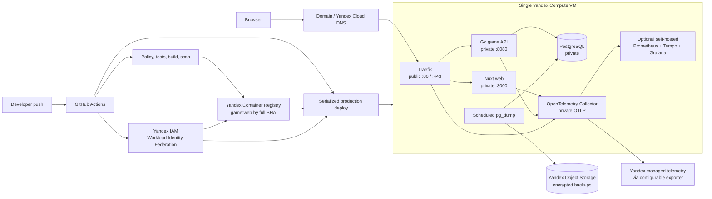

# Production infrastructure roadmap

## Статус документа

- **Снимок текущего состояния:** 2026-07-31.
- **Целевой deadline:** 2026-08-02 23:59 Europe/Moscow.
- **Назначение:** архитектурная карта и backlog для отдельных implementation
  plans.
- **Важно:** пункт в этом документе не доказывает реализацию. Текущее состояние
  подтверждают code, config, CI, deployment и результаты проверок.

## Цель

Подготовить публичный Munchkin-like pet project к инфраструктурному конкурсу
ШРИ 2026 как законченную production delivery story:

```text
commit
  -> GitHub Actions checks
  -> immutable game/web images in Yandex Container Registry
  -> controlled deployment to one Yandex Compute VM
  -> Traefik + HTTPS
  -> readiness and public smoke
  -> traces, metrics and deploy version in the selected telemetry UI
  -> off-host PostgreSQL backup and proven restore
  -> rollback to the previous compatible SHA
```

Конкурсный приоритет — не количество названий технологий, а доказуемая цепочка
delivery, observability, security и recovery.

## Целевая схема



## Подтверждённое текущее состояние

| Область | Что есть сейчас | Следствие |
|---|---|---|
| Git | `origin` и `origin/main` уже GitHub | Нужна миграция CI/CD, а не Git remote |
| CI | `.gitlab-ci.yml` remains parity source; `.github/workflows/ci.yml` now declares the same verification DAG and a gated publish tail | Run on GitHub and configure required checks before retiring GitLab CI |
| Runtime | Один dev `docker-compose.yml`: PostgreSQL, `game`, `web` | Нужен отдельный production topology |
| Network | Host ports `5432`, `8080`, `3000` опубликованы | На VPS наружу оставить только Traefik `80/443` |
| Images | Multi-stage backend/frontend images, оба запускаются non-root | Можно публиковать в registry после hardening |
| Health | `/health/live` и compatibility `/healthz` возвращают process-level `ok`; `/health/ready` выполняет bounded dependency probe | Public Traefik/readiness wiring remains in the production Compose plan |
| Shutdown | Backend делает graceful shutdown с timeout 10 секунд | Сохранить и проверить при rollout |
| Database | Named volume and explicit checksum-ledger migration job; application startup does not mutate schema | Production job wiring, backup and restore remain later gates |
| Realtime | Authenticated SSE с heartbeat/version invalidation | Нужен long-lived proxy smoke через Traefik |
| Studio | Local `.card-studio`, production persistence отсутствует | Оставить выключенной на public deployment |
| Telemetry | Go/Nitro privacy-safe OTLP foundation and private Collector fixtures are repository-local; no external sink or dashboard yet | Complete destination, retention, dashboards and alerts in the telemetry plan |
| IaC | Bootstrap/state applied; network/registry/compute graph locally validated, cloud apply gated | Завершить два reviewed apply и live host evidence |
| Delivery | Repository declares immutable image publication and digest-pair evidence; live WIF/apply/publication are not yet proven | Complete the owner-gated GitHub -> Container Registry -> Compute VM path |

## Неподвижные production-инварианты

1. Публичные порты VPS — только `22`, `80`, `443`; SSH policy может быть
   дополнительно ограничена provider firewall или allowlist.
2. PostgreSQL, Docker API/socket, OTLP, Prometheus и Tempo не публикуются в
   Internet.
3. Production deploy всегда ссылается на full Git commit SHA или image digest,
   но не на mutable `latest`.
4. Production images собирает CI, а не VPS.
5. Один environment допускает только один deploy одновременно.
6. Readiness и public HTTPS smoke выполняются до объявления deploy успешным.
7. Rollback не обещается для migration, несовместимой с предыдущим image.
8. Backup находится вне VPS и считается готовым только после restore drill.
9. Secrets отсутствуют в Git, image layers, command output, logs, traces,
   metrics и browser configuration.
10. Telemetry dimensions имеют bounded cardinality и не раскрывают private
    game state.
11. Card Studio и admin UI выключены либо недоступны с public ingress до
    отдельной production auth реализации.
12. Новая инфраструктура добавляется только с retention, healthcheck и
    понятным failure/restore path.
13. Доступ к Docker socket/`docker` group считается root-equivalent. CI не
    получает его неявно под названием «непривилегированный deploy user».
14. Yandex Cloud resources после bootstrap меняются через reviewed Terraform
    plan; production state приватен, versioned, encrypted и сериализован.
15. Lockbox payload не проходит через Terraform variables, plan или state.

## P0-A: submission-critical live deployment

До включения конкурсных differentiators должен существовать минимальный
submission gate:

- GitHub checks и immutable images проходят на target SHA;
- public HTTPS URL стабильно открывает UI/API;
- VPS/Traefik не публикуют database и management ports;
- readiness, public smoke и documented image rollback работают;
- README содержит ссылку, краткую схему и честно перечисленные ограничения.

**Freeze gate:** если к 2026-08-01 18:00 MSK этот контур не доказан, работа над
telemetry backend, restore automation и бонусами приостанавливается до
получения стабильной submission URL. Live project важнее незавершённого
observability stack.

### INFRA-001 — GitHub Actions parity

**Работа**

- Создать PR/push workflow для текущих harness, content, Go, PostgreSQL,
  frontend и Compose checks.
- Использовать минимальные `permissions`; write permission выдавать только job,
  который публикует package.
- Добавить dependency caching без ослабления frozen lock/go module checks.
- Не удалять `.gitlab-ci.yml`, пока GitHub workflow не прошёл на чистом commit.
- Настроить branch protection после первого зелёного workflow.

**Definition of Done**

- GitHub показывает один зелёный required workflow на `main`.
- Его состав не слабее текущего GitLab pipeline.
- Failure любого canonical check блокирует image publication/deployment.

**Статус 2026-07-31:** repository implementation добавила parity workflow с
минимальными permissions, отдельным `publish` tail после всех verification jobs,
protected environment contract и pinned action SHAs. Live green run, branch
protection и required-check configuration остаются owner-side gates.

### INFRA-002 — immutable images и Yandex Container Registry

**Работа**

- Собирать `game` и `web` через BuildKit.
- Публиковать оба image с full commit SHA; optional human-readable tag не
  участвует в deploy resolution.
- Добавить OCI metadata: source repository, revision, created time и license.
- Использовать registry build cache; production image запускается non-root.
- Использовать GitHub OIDC -> Yandex Workload Identity Federation вместо
  persistent authorized-key JSON для registry push.
- Добавить bounded image retention и on-push/scheduled vulnerability scan
  после проверки тарификации.
- Сохранить deploy-visible `service.version`/revision.

**Definition of Done**

- По одному Git SHA однозначно находятся два immutable image.
- Развёрнутая версия видна в telemetry или диагностическом endpoint.
- На VPS отсутствуют source checkout и production build toolchain как
  обязательная часть deploy.

**Статус 2026-07-31:** backend/frontend Dockerfiles получили OCI
`source`/`revision`/`created`/`licenses` labels. Workflow строит только
full-lowercase-SHA tags, проверяет отсутствие tag до push, получает remote
digests после обоих push и создаёт non-secret pair manifest только после
успешной двойной проверки. Terraform HCL добавляет keyless GitHub WIF и
registry-scoped pusher; cloud apply, claim-probe, first publication и live
label/digest evidence ещё не выполнялись.

### INFRA-003 — Yandex Cloud Terraform/Compute bootstrap и host security

**Статус 2026-07-31:** foundation slice применён и проверен. Bootstrap IAM
добавил keyless runtime identity и exact deployer roles (`7 added`), production
root создал VPC/subnet/SG/reserved IPv4/private registry с двумя repositories,
Ubuntu VM и standalone data disk (`10 added`). Remote production state
существует, `.tflock` освобождён, follow-up plan сообщает `No changes`.
Owner-side SSH evidence подтвердил host-key pinning, key login,
`cloud-init=done`, Docker/Compose, отдельный ext4 mount, log limits,
password/root denial и отсутствие публичных listeners кроме SSH. Local
delivery artifacts now define the automation deploy user/root boundary and
reboot unit; VM bootstrap/deploy, DNS/TLS, backup and telemetry remain live
mutation/evidence gates.

**Работа**

- Создать reviewed Terraform graph для VPC, subnet, security groups, static
  IPv4, Ubuntu LTS Compute VM, disks, service accounts и минимальных IAM roles.
- Выбрать доступную zone; default `ru-central1-d` проверяется через актуальный
  `yc compute zone list`.
- Хранить Terraform state в отдельном private/versioned/KMS-encrypted Object
  Storage bucket и запретить concurrent apply до доказанного locking.
- Зафиксировать минимальный resource budget и billing notifications.
- На foundation VM создать trusted human bootstrap user; отдельный automation
  deploy user и узкая root-owned command boundary выполняются вместе с
  production deployment slice.
- Зафиксировать SSH host key VPS в GitHub deploy configuration и запрещать
  `StrictHostKeyChecking=no`.
- Отключить password login и прямой root login после проверки нового доступа.
- Разрешить firewall ports `22`, `80`, `443`; не открывать Docker daemon.
- Установить security updates, Docker Engine и Compose plugin.
- Создать отдельные каталоги для Compose config, secrets, Traefik ACME,
  PostgreSQL и backup state с минимальными permissions.
- Включить Docker после reboot; запуск и reboot-recovery production stack
  проверяются после появления production Compose.
- Ограничить Docker log size и следить за disk/inode usage.
- Выбрать честную Docker privilege boundary:
  - предпочтительно root-owned fixed deploy script/systemd unit с узким
    allowlisted `sudo` rule;
  - либо явно принять, что membership в `docker` group является
    root-equivalent, и записать этот риск;
  - не выдавать workflow произвольный shell/root доступ под видом least
    privilege.

**Definition of Done**

- Reboot VPS восстанавливает production stack без ручной пересборки.
- `5432`, `8080`, `3000`, OTLP и telemetry storage недоступны снаружи.
- SSH password/root login не работает, key-based deploy user работает.
- Подмена SSH host key останавливает deploy.
- Deploy automation не может выполнить произвольную root-команду вне
  задокументированной boundary.

### INFRA-004 — production Compose и Traefik

**Работа**

- Оставить local dev Compose самостоятельным и создать production Compose
  поверх registry images.
- Разделить public edge, application и data/observability networks.
- Сделать Traefik единственным service с host ports `80/443`.
- Настроить HTTP -> HTTPS, router `/api/v1` -> `game`, fallback `/` -> `web`.
- Использовать `providers.docker.exposedByDefault=false`; доступ к Docker
  socket ограничить read-only, socket proxy либо file provider.
- Не публиковать Traefik dashboard; при необходимости дать ему отдельную
  authenticated/allowlisted route.
- Persist ACME state и сначала проверить issuance на staging CA.
- Добавить restart policy, `stop_grace_period`, healthchecks, CPU/RAM и log
  limits.
- Не включать Card Studio и admin endpoints в public production config.

**Definition of Done**

- Внешний port scan видит только SSH/HTTP/HTTPS.
- HTTP всегда переходит на HTTPS.
- Public UI и API работают на одном hostname.
- Длительный SSE smoke переживает heartbeat и container restart/resync.
- Пересоздание Traefik не теряет действующий ACME account/certificate state.

**Статус 2026-08-01:** production Compose/Traefik, file-provider routes,
digest-pinned game/web anchors, one-shot migration service and root-owned host
boundary are implemented locally. The production VM and public edge have not
been mutated; only Traefik is assigned public `80/443` in the local topology.

### INFRA-005 — domain, DNS и TLS

**Рекомендуемый путь**

- Купить один недорогой domain и создать `A` record на public IPv4 VPS.
- Не создавать `AAAA`, пока IPv6 routing/firewall/Traefik не проверены.
- Использовать один hostname для UI/API; отдельный Grafana hostname допустим
  только с authentication.
- Проверить certificate chain, renewal, redirect и отсутствие mixed content.
- HSTS включать после стабильной проверки HTTPS, чтобы не заблокировать
  исправление ранней конфигурации.

**Fallback**

Let's Encrypt с 2026 года поддерживает short-lived IP certificates, но их
automation и поддержка выбранным ACME client проверяются отдельно. Для
конкурсной ссылки настоящий domain остаётся предпочтительнее.

**Definition of Done**

- Submission URL человекочитаем, открывается с valid certificate.
- DNS TTL и A record задокументированы.
- Renewal/ACME state переживают restart.

**Статус 2026-08-01:** Terraform now contains local-only metadata for the
Yandex public zone and `munchkin.l1ttl3h0rse.ru` A record to the reserved
`81.26.187.230`. Timeweb NS delegation, public DNS propagation and ACME
issuance remain owner-approved mutation gates and were not performed.

### INFRA-006 — liveness, readiness и migrations

**Работа**

- Оставить process liveness дешёвой и независимой от downstream.
- Добавить readiness, которая проверяет PostgreSQL и загруженный immutable
  content pack.
- Не возвращать secrets, DSN или internal state из health responses.
- Выделить migration command/job; production application запускается с
  `AUTO_MIGRATE=false`.
- Зафиксировать backward/forward compatibility policy для rollback.

**Definition of Done**

- При остановленном PostgreSQL liveness остаётся осмысленной, readiness
  становится unhealthy.
- Traefik/deploy не направляет traffic на unready service.
- Migration выполняется ровно один раз до rollout и имеет наблюдаемый exit
  status.

**Статус 2026-08-01:** repository contract implemented: `/health/live`,
bounded dependency-aware `/health/ready`, compatibility `/healthz`, and the
one-shot `/app/migrate` command with PostgreSQL advisory lock, ordered files,
checksum ledger and distinct exit codes. Production Compose rollout evidence
and real PostgreSQL smoke remain gates of the next deployment slice.

### INFRA-007 — controlled CD, smoke и rollback

**Работа**

- Использовать GitHub production environment и deploy concurrency group.
- Секреты VPS доступны только deploy job.
- Проверять pinned SSH host key до передачи deployment commands.
- Перед rollout сохранять предыдущие game/web SHA.
- На VPS передавать только target image references и production config.
- Выполнить pull, migration, Compose update, readiness и public HTTPS smoke.
- Smoke должен как минимум открыть UI, проверить API health и создать тестовую
  lobby/game через публичный route без вывода credential в logs.
- При failure вернуть предыдущие compatible images и повторить smoke.
- Сохранять deploy metadata: actor, workflow run, SHA, start/end и result.

**Definition of Done**

- Push или manual workflow разворачивает конкретный SHA без SSH-команд руками.
- Одновременный второй deploy не смешивает состояния.
- Намеренно сломанный healthcheck не становится successful deployment.
- Предыдущий compatible SHA восстанавливается документированной командой.
- Privilege path deployment job -> host script/unit описан и проверен; доступ
  к Docker не называется непривилегированным, если он root-equivalent.

**Статус 2026-08-01:** manual main-only workflow, forced-command SSH gateway,
atomic current/previous release evidence, internal/public smoke hooks and
compatible rollback guard are implemented locally. GitHub environment,
protected secrets, VM bootstrap and first production rollout remain unrun
because they require separate mutation approvals.

## P0-B: конкурсные differentiators после submission gate

Следующие пункты дают основной инфраструктурный конкурсный сигнал, но
выполняются только после работающего P0-A. При нехватке времени порядок:
OpenTelemetry trace/metrics -> dashboard -> off-host backup/restore ->
расширенный security/demo polish.

### INFRA-008 — OpenTelemetry foundation

**Топология**

```text
Go game / Nitro server / Traefik
            -> OTLP
            -> local OpenTelemetry Collector
                 -> configured traces backend
                 -> configured metrics backend
                 -> logs backend later
```

**Первый instrumentation scope**

- HTTP server duration/count/inflight и status по route template.
- Application command duration/outcome/error code.
- Idempotency replay/reuse conflict и optimistic version conflict.
- PostgreSQL pool saturation и query spans без SQL arguments.
- Active SSE connections, disconnects и resync reasons.
- Resource attributes:
  `service.name`, `service.version`, `deployment.environment`,
  `service.instance.id`.
- W3C trace context через ingress/backend; server-generated request
  correlation для logs.

**Privacy и cardinality denylist**

Никогда не писать в span attributes, events, logs или metric labels:

- bearer token, credential hash, `DATABASE_URL`, API keys;
- request/response body, raw event payload или snapshot;
- hand/deck order, RNG state, prompt и generated image;
- game/player/card/command/request/provider request ID;
- display name, произвольный URL/path или exception text с secret payload.

Допустимые metric dimensions ограничены enum:

- service и bounded environment;
- HTTP route template, method и status class/code;
- command type, bounded outcome/error code;
- configured provider name.

`service.version`, Git SHA, `service.instance.id` и content version остаются
trace/log resource attributes. Их нельзя автоматически добавлять к каждой
Prometheus series: версия показывается через одну build-info metric,
deployment annotation либо dashboard variable с контролируемой series.

**Sampling**

- Для небольшого конкурсного traffic отправлять spans в локальный Collector с
  SDK `always_on`; Collector применяет bounded tail sampling, чтобы сохранять
  ошибки/медленные traces и выборку успешных.
- Ограничить memory/queue/batch и maximum traces в Collector до включения
  `always_on`.
- Если нагрузка потребует SDK head sampling, явно принять, что полнота
  error/slow traces больше не гарантируется; не обещать их последующее
  восстановление tail sampler.
- Collector export failure не должен блокировать gameplay request.
- Retention и disk/memory limits обязательны до включения production volume.

**Definition of Done**

- Один публичный request виден как trace от ingress/backend до PostgreSQL span.
- Dashboard различает version/deployment environment.
- Отключение telemetry backend не ломает game API.
- Automated test/inspection не находит denylisted attributes.

**Статус 2026-08-01:** Go and Nitro server-only OTLP wiring, bounded resource
attributes, allowlisted W3C propagation, failure isolation and private
Collector fixtures are implemented and locally build-tested. External sink,
tail sampling, retention, dashboards, alerts and live trace evidence remain
owned by the subsequent telemetry plans.

### INFRA-009 — telemetry destination и golden dashboard

**Профили**

| Профиль | Когда выбирать | Состав |
|---|---|---|
| Managed | Маленькая VPS или минимальный operational risk | Local Collector -> managed OTLP-compatible backend |
| Self-hosted demo | Ресурсы измерены и retention ограничен | Collector + Prometheus + Tempo + Grafana |

Loki/log aggregation не блокирует P0: сначала достаточно structured JSON
stdout с `trace_id`/`span_id` и bounded Docker log rotation.

**Golden dashboard**

- request rate, 4xx/5xx и p50/p95 latency;
- readiness и deploy version;
- command outcome/conflict rate;
- PostgreSQL pool/query latency;
- active SSE connections;
- Collector rejected/dropped/export-failed telemetry;
- disk/memory pressure и backup age, когда exporters появятся.

**Initial demo thresholds**

Это стартовые сигналы, а не обещанный SLA; после load measurement они
пересматриваются:

- public readiness unavailable более 2 минут;
- 5xx rate выше 1% в устойчивом окне;
- disk free ниже 15%;
- последний успешный backup старше 26 часов;
- p95 non-streaming API latency выше измеренного demo threshold.

**Definition of Done**

- Grafana либо выбранный managed visualization UI показывает traffic и trace,
  созданные живой игрой.
- Telemetry имеет bounded retention и не публикуется без authentication.
- Deploy SHA отмечен на dashboard или доступен как filter/annotation.

**Статус 2026-08-01:** managed Yandex Monium is fixed as the metrics/traces-
only destination. Local Collector wiring now has private OTLP receivers,
privacy deletion, bounded tail sampling/queue/retry, no logs pipeline and the
owner-only runtime secret boundary. Terraform declares only the dedicated
keyless writer identity, the exact two Monium writer roles and a
low-cardinality dashboard; alert/channel YAML remains an owner-approved
Monium import. The 60-minute live soak, trace/metric query evidence, alert
delivery, host disk metric and resource/cost review remain unrun because they
require separate remote/secret/mutation approvals.

### INFRA-010 — off-host PostgreSQL backup и restore

**Работа**

- Запускать scheduled `pg_dump --format=custom`.
- Шифровать backup до отправки либо использовать проверенное server-side
  encryption вместе с отдельной credential policy.
- Загружать в внешний S3-compatible bucket, не размещённый на той же VPS.
- Хранить checksum, timestamp, schema/application version и backup size.
- Начальная retention policy: 7 daily + 4 weekly; подтвердить после оценки
  размера и бюджета.
- Удалять local temporary artifact после подтверждённой upload/checksum.
- Восстанавливать latest backup во временную database и выполнять проверку
  migration/schema и минимального game query.
- Экспортировать timestamp/result последнего backup/restore drill.

**Definition of Done**

- Потеря VPS не уничтожает последнюю off-host копию.
- Restore выполнен реальной командой, а не описан только теоретически.
- Ошибка upload, stale backup или checksum failure видны оператору.
- Backup credential не даёт приложению лишних bucket permissions.

**Статус 2026-08-01:** local Terraform declares the deletion-protected KMS
key, private versioned/static-auth-disabled backup bucket, exact runtime
uploader/encrypter boundary and conditional operator viewer/decrypter boundary.
Root-owned keyless backup/restore scripts, 03:00 Europe/Moscow systemd units,
manifest/SHA-256 commit marker, disposable restore Compose and owner-only
freshness/failure alert definitions are implemented. First-dump growth,
non-production PUT/HEAD/GET probe, Terraform apply, VM installation, first
verified backup, actual isolated restore/RPO/RTO, alert import/test delivery,
reboot recovery and account-specific cost evidence remain unrun because each
requires a separate remote/runtime approval or unavailable Docker/Monium state.

### INFRA-011 — security и supply-chain minimum

**Работа**

- Production secrets вне repository; env/config files имеют минимальные
  permissions.
- GitHub workflow использует least-privilege permissions и не печатает
  secrets.
- PostgreSQL использует production credential, не dev default.
- Traefik добавляет безопасные headers после проверки приложения.
- Registry image проходит vulnerability scan; критические findings имеют
  явное решение.
- Dependency update bot и SBOM являются strong bonus, если не задерживают
  рабочий deploy.
- Grafana защищена authentication/allowlist; Prometheus, Tempo и Collector
  private.

**Definition of Done**

- Secret scan и ручной просмотр workflow/container logs не находят credentials.
- Public surface соответствует ожидаемым routes/ports.
- Image и dependency risk видим в CI, а не обнаруживается только после deploy.

**Статус 2026-08-01:** repository baseline implemented locally: least-privilege
IAM/WIF assertions, no managed static keys, UFW/audit/sysctl and container
hardening, exact-SHA free scanner workflow, digest-bound SPDX/provenance
evidence, fail-closed deploy verification and report-only registry retention.
Production secrets remain outside the repository. Live GitHub branch/check/
environment settings, Yandex IAM/network/registry convergence, first image and
attestation publication, host audit and any destructive/paid action remain
separate owner-approved gates. See
[`PRODUCTION_SECURITY.md`](../operations/PRODUCTION_SECURITY.md) and
[`SUPPLY_CHAIN.md`](../operations/SUPPLY_CHAIN.md).

### INFRA-012 — documentation и конкурсный demo

**README/runbooks**

- публичная HTTPS ссылка;
- архитектурная схема и объяснение modular-monolith choice;
- CI/deploy badge и deployed SHA;
- local start отдельно от production topology;
- deploy, rollback, backup и restore runbooks;
- observability screenshots и privacy/cardinality решения;
- известные ограничения: single VPS, no HA, guest credentials, disabled Studio.

**Пятиминутный demo**

1. Показать commit и зелёный GitHub Actions run.
2. Показать два Yandex Container Registry image с этим SHA.
3. Показать successful deploy и public HTTPS.
4. Создать игру и открыть trace до PostgreSQL span в выбранном telemetry UI.
5. Показать dashboard с request/command/SSE signals и deploy version.
6. Показать последний off-host backup и результат restore drill.
7. Запустить rollback либо controlled container restart и показать recovery.

**Definition of Done**

- Незнакомый проверяющий может открыть проект и понять delivery architecture
  без устного восстановления контекста.
- Все показанные capabilities реально выполняются; roadmap-only пункты явно
  обозначены как future.

## Рекомендуемая последовательность до deadline

| Дата | Основной результат | Work items |
|---|---|---|
| 30 июля | GitHub pipeline и immutable registry artifacts | INFRA-001, INFRA-002 |
| 31 июля | VPS, production Compose, Traefik, domain/TLS | INFRA-003, INFRA-004, INFRA-005 |
| 1 августа до 18:00 | Health/CD, stable public URL и freeze gate | INFRA-006, INFRA-007, минимальный INFRA-012 |
| 1 августа после gate | OTel trace/metrics и выбранный dashboard | INFRA-008, INFRA-009 |
| 2 августа | Backup/restore, security review, rollback rehearsal и demo | INFRA-010 — INFRA-012 |

Если schedule начинает сдвигаться, порядок сокращения:

1. до freeze gate остановить telemetry/backup work и получить live HTTPS URL;
2. после gate оставить logs aggregation на потом;
3. выбрать managed telemetry вместо self-hosted stack;
4. отложить exporters/load tests/signing;
5. не сокращать HTTPS, readiness и rollback; restore proof выполнять первым
   после минимального OTel dashboard, если остаётся время.

## P1: сильные конкурсные бонусы

| ID | Улучшение | Наблюдаемый результат |
|---|---|---|
| INFRA-B01 | Loki/Alloy и JSON logs | Переход trace -> correlated logs без secret leakage |
| INFRA-B02 | node/cAdvisor/PostgreSQL/Traefik metrics | Видны host, container, DB и ingress bottlenecks |
| INFRA-B03 | Alertmanager/managed alerts | Telegram/email получает readiness, 5xx, disk и backup alerts |
| INFRA-B04 | Trivy, SBOM, Dependabot, затем Cosign | Supply-chain evidence привязан к exact image SHA |
| INFRA-B05 | Ansible или cloud-init | Новая VPS воспроизводимо получает host baseline |
| INFRA-B06 | k6 smoke/load thresholds | CI или manual run проверяет latency/error budgets |
| INFRA-B07 | External synthetic monitor | Failure VPS/DNS/TLS виден вне самой VPS |
| INFRA-B08 | CSP/HSTS/nosniff/referrer policy | Browser security headers проверяются автоматически |
| INFRA-B09 | Deploy annotations | Grafana связывает изменение latency/errors с rollout SHA |
| INFRA-B10 | Docker socket proxy/file provider | Traefik не получает бесконтрольный raw Docker socket |

## P2: после конкурса

- Production admin console с отдельной identity/RBAC, redacted read models и
  immutable audit trail.
- S3-compatible storage/CDN для Card Studio candidates и published card art.
- Registered accounts/OIDC вместо только game-scoped guest participants.
- Nitro/Card Studio provider traces и browser RUM с privacy review.
- Более богатые battle summaries/analytics после появления безопасных read
  models.
- Staging environment и preview deployments, если стоимость оправдана.
- Multi-VPS/managed PostgreSQL/HA только после появления SLA и нагрузки.
- Kubernetes/Helm/ArgoCD/service mesh только при реальной multi-service или
  multi-node boundary.
- External realtime adapter/message broker только при horizontal scaling.

## Открытые решения и рекомендуемые defaults

| Решение | Default до новых данных | Что подтвердить |
|---|---|---|
| Provider/region | Yandex Cloud, одна Compute VM; `ru-central1-d` если доступна | Фактическая zone/quota, RAM/CPU/disk, calculator estimate |
| Infrastructure as code | Terraform; один production root после bootstrap | Pinned Terraform/provider и reviewed state migration |
| Terraform state | Private/versioned/KMS-encrypted Object Storage; serialized apply | `use_lockfile` compatibility test, restricted backend credential rotation |
| VPS size | Managed telemetry для малого host; self-host только после measurement | Peak RAM, disk growth, retention |
| Domain | Купить domain; public zone/records в Cloud DNS | Registrar access, hostname, existing records |
| IPv6 | Не публиковать `AAAA` до end-to-end test | Provider route, firewall, Traefik |
| Telemetry sink | Local Collector -> Yandex managed telemetry; exporter configurable | Credentials, pricing, retention и OTLP integration smoke |
| Backup storage | Отдельный encrypted Yandex Object Storage bucket | KMS, retention, checksum и restore drill |
| Deploy trigger | Manual production approval либо explicit dispatch | Repository visibility/plan и desired automation |
| Alerts | Telegram или email | Канал, quiet hours, escalation |
| Grafana exposure | Authenticated hostname или SSH tunnel | Authentication и allowlist |

## Разбиение на будущие implementation plans

Каждый пункт ниже проходит обычный approve/select/verify lifecycle и не
смешивается с остальными без явного расширения scope:

1. `yandex-cloud-terraform-bootstrap-and-state`
2. `yandex-cloud-network-registry-and-compute`
3. `github-actions-yandex-images`
4. `production-compose-traefik-and-deploy`
5. `backend-readiness-and-opentelemetry`
6. `telemetry-backend-dashboards-and-alerts`
7. `postgres-object-storage-backup-and-restore`
8. `contest-readme-runbooks-and-demo`

Отдельные уже подготовленные draft-направления:

- `20260729T224707Z-7f21dd-record-card-art-object-storage`;
- `20260729T225611Z-bbcbc3-record-future-admin-control-plane`.

Они не блокируют Sunday MVP и не должны расширять его auth/storage scope.

## Источники

- Repository truth: `.gitlab-ci.yml`, `docker-compose.yml`,
  `backend/game/Dockerfile`, `frontend/Dockerfile`,
  `backend/game/cmd/server/main.go`,
  `backend/game/internal/transport/httpapi/router.go`.
- [ADR-0009: Yandex Cloud and Terraform](decisions/0009-yandex-cloud-terraform-production.md)
- [Yandex Cloud owner bootstrap](../operations/YANDEX_CLOUD_TERRAFORM_BOOTSTRAP.md)
- [Yandex Cloud: Terraform quickstart](https://yandex.cloud/ru/docs/terraform/quickstart)
- [Yandex Cloud: Terraform state in Object Storage](https://yandex.cloud/ru/docs/terraform/tutorials/terraform-state-storage)
- [Yandex Cloud: Workload Identity Federation](https://yandex.cloud/ru/docs/iam/concepts/workload-identity)
- [Yandex Cloud: Container Registry](https://yandex.cloud/ru/docs/container-registry/)
- [Yandex Cloud: availability zones](https://yandex.cloud/en/docs/overview/concepts/geo-scope)
- [OpenTelemetry Collector](https://opentelemetry.io/docs/collector/)
- [GitHub: publishing Docker images](https://docs.github.com/en/actions/tutorials/publish-packages/publish-docker-images)
- [GitHub: deployments and environments](https://docs.github.com/en/actions/reference/workflows-and-actions/deployments-and-environments)
- [Traefik ACME](https://doc.traefik.io/traefik/https/acme/)
- [Let's Encrypt: short-lived and IP certificates](https://letsencrypt.org/2026/01/15/6day-and-ip-general-availability.html)
