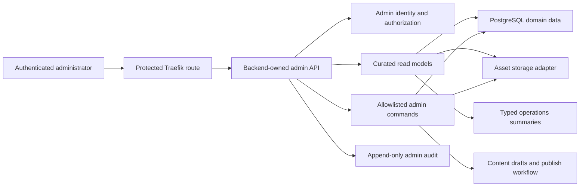

# ADR-0006: Future administration control plane

- **Статус:** accepted
- **Дата:** 2026-07-30

## Контекст

Проекту в будущем нужна production admin console, в которой владелец сможет
видеть предметные сущности проекта, управлять следующими draft-версиями
контента и безопасно разбирать состояние игр. Это не должна быть оболочка над
PostgreSQL, filesystem, object storage или внутренним snapshot.

Подтверждённое текущее состояние существенно уже целевого:

- PostgreSQL хранит `games`, game-scoped `game_players`, append-only
  `game_events` и idempotency `game_command_receipts`;
- global users, admin identities, roles и admin audit log отсутствуют;
- `games.snapshot`, event payloads и сохранённые receipt projections могут
  содержать authoritative и actor-private данные;
- игровые bearer credentials действуют только внутри конкретной игры и не
  являются admin identity;
- authenticated SSE передаёт version invalidation, а не сохранённую историю;
- опубликованный content pack фиксируется immutable
  `(set_id, version, content_digest)`;
- Card Studio является disabled-by-default local/dev workflow: jobs и raw
  candidates живут в ignored staging, а approve изменяет только draft
  следующей версии. Общего production content CRUD или asset repository нет;
- production admin route, admin API, shared Studio persistence и
  S3-compatible asset plane не реализованы.

[ADR-0007](0007-single-vps-production-platform.md) сначала требует стабильную
delivery-цепочку: HTTPS, readiness, observability, backup/restore и rollback.
Infrastructure roadmap относит admin console, отдельную identity/RBAC и
production asset storage к P2 после конкурсного P0-A/P0-B. Admin не блокирует
первый public MVP.

## Решение

### Статус решения

Этот ADR фиксирует только future architecture boundary. Он не добавляет
runtime route, API, schema, migration, identity provider, bucket, UI или
production exposure и не доказывает существование admin console.

Каждая реализация ниже требует отдельного approved plan. До появления
отдельной admin identity/auth boundary admin и Card Studio остаются
недоступными через public ingress.

### Control-plane boundary

Admin строится как отдельный control plane поверх backend-owned typed API:



Admin frontend:

- не подключается напрямую к PostgreSQL;
- не получает generic SQL/query console;
- не читает server filesystem или bucket listing;
- не получает S3, backup, database, provider или deployment credentials;
- не вызывает internal engine/store methods в обход application boundary;
- не принимает игровые bearer credentials как admin authentication;
- работает только с versioned schemas, явными query models и allowlisted
  commands.

Первый implementation профиль остаётся частью modular monolith. Отдельный
service допускается позднее только при появлении самостоятельной security,
scaling или ownership boundary.

### Что означает «показать всё, что хранится»

Требование означает полное каталогизированное покрытие предметных классов
curated read-моделями. Для каждого сохранённого класса implementation plan
обязан выбрать одно из трёх состояний:

1. безопасная typed admin projection;
2. агрегированный/redacted summary;
3. явно запрещённый raw класс с объяснением и безопасной заменой.

Оно не означает raw DB/filesystem/object-storage browser.

| Область | Безопасная admin-модель | Запрещённый raw доступ |
|---|---|---|
| Content sets | identity, version, digest, state, timestamps, validation summary | произвольная правка published manifest |
| Decks/cards | draft fields, typed mechanics, membership, validation errors, diff | unknown effects, arbitrary JSON/code |
| Assets/provenance | opaque asset ID, content/card link, state, MIME, dimensions, checksum, provenance summary | bucket key listing, filesystem path, credentials |
| Card Studio jobs | state, bounded error code, timestamps, attempt/result summary | prompt/provider payload, secret, unrestricted raw candidate |
| Games | lifecycle state, content identity, version, timestamps, participant count | snapshot, deck order, RNG/internal engine state |
| Participants | game-scoped identity/seat and explicit allowlisted public/admin fields | bearer credential, credential hash, private hand/options |
| History/battles | redacted typed timeline and derived battle summaries | raw event payload, replay snapshot, receipt projection |
| Audit | allowlisted immutable mutation record | request body, response body, secret or private state |
| Operations | deployed SHA, readiness, backup/restore and safe job summaries | infrastructure config, backup contents, telemetry storage |

Opaque domain identifiers, когда они нужны оператору для конкретной операции,
могут находиться в защищённой admin response. Они не становятся metric labels,
не копируются в trace attributes по умолчанию и не подменяют credential.
Display name считается пользовательскими данными: read model включает его
только при явной необходимости, UI экранирует его, audit не дублирует его.

### Admin identity, authorization и ingress

Admin identity полностью отделена от game-scoped guest credentials.

Для первого P2 slice рекомендуется:

- один минимальный `owner/admin` role;
- отдельная проверяемая admin authentication boundary;
- deny-by-default authorization для каждого query и command;
- отсутствие impersonation, account management и общего RBAC editor;
- short session lifetime, CSRF/session protections и strong transport
  security, конкретные механизмы которых выбирает auth implementation plan.

Конкретный IdP, OIDC flow, protected hostname, session mechanism и полная RBAC
matrix не выбираются этим ADR. Нельзя временно заменить их:

- общим bearer token из игры;
- Card Studio authoring token;
- secret query parameter;
- доверенным client-supplied role;
- публичным route с UI-only проверкой.

До реализации auth route отсутствует. После реализации Traefik публикует
только отдельный защищённый hostname/path через backend; PostgreSQL, object
storage management API, backup storage, OTLP и container interfaces не
получают public ports.

### Read-model и privacy boundary

Admin queries принадлежат server-side projector/read-model layer. Projector
явно allowlist-ит поля и не сериализует internal structs.

По умолчанию запрещены:

- raw `games.snapshot`;
- raw `game_events.payload`;
- raw `game_command_receipts`, request fingerprint и сохранённая projection;
- bearer tokens и credential hashes;
- hand/deck order, hidden cards, private carried state и pending private
  choices;
- RNG state, seed и replay internals;
- internal eligible actor set, чужие responses и private options interaction
  windows;
- prompts, generated-image provider payloads и provider request IDs;
- raw Studio staging directory и unrestricted candidates;
- backup objects, backup credentials и backup contents;
- secrets, raw infrastructure config, request/response bodies и arbitrary
  exception text.

Read models являются paginated, filterable и bounded. Их schemas versioned.
Large/raw fields не появляются через «debug», `include_all` или generic
expansion flag. Любой диагностический доступ проектируется отдельно.

### Games, participants и accounts

Первый admin slice показывает существующую domain truth: game-scoped guest
participants. Он не переименовывает их в global users и не создаёт ложной
account model.

Registered accounts/OIDC являются отдельным P2+ domain decision. Если они
появятся, связь account-to-participant, consent, retention, deletion и
authorization проектируются отдельно. До этого раздел может называться
«Участники игр», но не «Пользователи платформы».

### Redacted history и battle summaries

Сохранённые events остаются internal replay source, а не admin wire format.
History projector строит versioned typed timeline:

- публично допустимые участники и phase transitions;
- action kind и bounded outcome/error code;
- interaction kind, terminal close reason и server-recorded timeout outcome;
- derived combat totals/rewards только в объёме, не раскрывающем private hand
  или future choices;
- ссылки на content identity/version/digest вместо mutable card text.

Timeline будущих multiplayer mechanics использует семантику
[ADR-0008](0008-multiplayer-interaction-windows.md): stable interaction kind,
outcome и close reason. Он не раскрывает internal eligibility, per-actor
response state, hidden options или opaque-window rationale.

Derived timeline может быть перестроен из authoritative data по versioned
projector. Неизвестный event/schema fail-closed: UI показывает недоступность
redacted representation, а не отдаёт raw payload.

Break-glass raw-state browser не входит ни в первый MVP, ни в этот ADR. Если
он когда-либо понадобится, отдельное решение обязано определить strong
re-authentication, purpose/expiry, dual control либо эквивалентную защиту,
immutable access audit, redacted export и запрет постоянного generic browser.

### Content draft и immutable publish

Published `(set_id, version, content_digest)` никогда не редактируется.
Mutation workflow работает только над draft следующей версии:

1. создать draft от явной base identity;
2. изменять только typed fields через expected draft revision;
3. показать diff и validation results;
4. проверить schema, registered effects, assets и provenance;
5. вычислить canonical digest;
6. зафиксировать новый immutable artifact;
7. зарегистрировать publish result и audit;
8. только после успеха сделать новую identity видимой для выбора будущими
   играми.

Уже начатая игра продолжает использовать pinned set/version/digest.

Publish является идемпотентным state machine, а не набором несвязанных
frontend calls. Success не подтверждается и новая version не становится
видимой, пока immutable manifest, все referenced published assets,
provenance, digest и authoritative registry state не согласованы.

Implementation plan обязан выбрать recoverable transaction/outbox/staging
mechanism для PostgreSQL и object storage. Частичный результат остаётся
невидимым draft/recoverable state; состояние «published в registry, но asset
отсутствует или mutable» запрещено.

Unknown mechanic/effect, invalid provenance, digest drift, missing asset,
absolute/remote/traversing path и unsupported schema fail-closed в
соответствии с [ADR-0003](0003-content-pack-and-licensing-boundary.md).

### Assets и Card Studio

Production asset catalog работает только через backend admin API и storage
adapter. Admin видит metadata по opaque asset ID, а не physical path/key.

Raw candidates остаются private authoring artifacts. Preview выдаётся только
после authorization как short-lived, scoped, non-listable signed access.
Точный TTL, vendor, key layout, lifecycle, CDN, encryption и migration
определяются storage implementation plan; этот ADR не фиксирует случайные
числа или provider contract.

Published art сначала связывается с immutable content identity и provenance.
Только после этого отдельная policy может разрешить cache/CDN для
digest-addressed object.

Card-art objects и off-host PostgreSQL backups являются разными data classes:

- отдельные logical buckets/namespaces;
- отдельные IAM credentials и least-privilege policies;
- независимые retention, recovery и audit;
- admin asset catalog никогда не list/read-ит backup bucket.

Card Studio остаётся специализированным art workflow. Его существующий local
token не становится production admin auth, а наличие draft directory не
доказывает существование опубликованного pack.

### Admin commands и audit

Query и mutation permissions разделяются. Admin command содержит
idempotency/correlation identity, expected resource revision там, где возможна
гонка, и canonical fingerprint. Client не выбирает final digest, storage key,
actor authority или validation outcome.

Каждая попытка admin mutation создаёт append-only audit record с минимальной
allowlist:

```text
audit_id
admin_subject_id
action_kind
target_kind
opaque_target_reference
occurred_at
result_code
command_correlation
policy_version
```

Audit не содержит credential, display name, prompt/image, raw request/response,
snapshot, event payload, private player state, secret или arbitrary error
text.

Для database mutation authoritative mutation и её success audit фиксируются
одной транзакцией; mutation без audit не commit-ится. Rejected attempts
записываются безопасным отдельным result, если это можно сделать без
раскрытия credential или существования чужого target.

External asset/publish workflow использует idempotent persisted state machine:
каждый state transition auditable, а финальный success появляется только
после целостного publish boundary. Нельзя притворяться, что PostgreSQL и S3
образуют несуществующую distributed transaction.

Application role не изменяет и не удаляет audit rows. Audit retention/export,
separate archive и cryptographic tamper evidence определяются отдельным
implementation plan до production mutations.

### Audit не является OpenTelemetry

Audit и operational telemetry решают разные задачи:

| Свойство | Admin audit | OpenTelemetry |
|---|---|---|
| Назначение | доказательство privileged mutation | health/performance диагностика |
| Полнота | unsampled для allowlisted mutation events | может sampling-иться |
| Хранение | append-only policy | bounded operational retention |
| Payload | минимальная allowlist | bounded attributes/metrics |
| Failure | успешная DB mutation без audit запрещена | export failure не блокирует gameplay |

OTel наследует privacy/cardinality boundary ADR-0007. В telemetry нельзя
помещать admin request/response, audit payload, display names, content text,
game/player/card/command IDs, credential, prompt, image, snapshot или secret.
Route templates, action kind и bounded result enum допустимы.

### Operations summaries

Operations UI читает только typed summaries:

- deployed full SHA/image identity;
- liveness/readiness и безопасные component states;
- migration compatibility/status без raw SQL;
- возраст/result последнего backup и restore drill;
- bounded Card Studio job counts/states;
- safe audit health и telemetry export health;
- configured content identity/digest.

Он не показывает:

- environment variables, secrets или DSN;
- Docker socket, Compose/config dump или host shell;
- raw logs/traces и telemetry backend credentials;
- backup objects/contents или restore dump;
- arbitrary database query;
- filesystem/bucket browser.

### Migrations, readiness, backup и rollback

Admin schemas, read models и audit data наследуют ADR-0007:

- migrations выполняются отдельно и проектируются вместе с compatible image
  rollback;
- production writes включаются только после readiness нужных schema,
  identity, audit и storage dependencies;
- PostgreSQL backup/restore включает authoritative admin/audit tables,
  которые не являются rebuildable;
- rebuildable read models получают explicit rebuild/version strategy;
- asset storage имеет отдельную recovery policy и не считается частью
  PostgreSQL backup;
- rollout проходит protected-route/auth/redaction smoke;
- rollback не обещается через incompatible migration или irreversible publish.

Новая mutation capability остаётся feature-disabled до доказанных migration,
backup/restore, audit и rollback boundaries.

### Поэтапный P2 roadmap

1. **Prerequisite gate.** Стабильные HTTPS deploy, readiness, observability,
   PostgreSQL backup/restore и compatible rollback из P0-A/P0-B.
2. **Owner-only read MVP.** Отдельная admin identity, защищённый route,
   owner/admin role, curated content/game/participant/operations read models и
   redaction tests. Никаких content mutation.
3. **History and audit foundation.** Versioned redacted timeline, battle
   summaries, append-only audit store и audit viewer.
4. **Draft/publish and assets.** Typed draft CRUD, validation/diff,
   S3-compatible asset adapter, private candidate preview и recoverable
   immutable publish.
5. **Accounts and authorization growth.** Только при подтверждённой
   потребности: registered accounts/OIDC, expanded RBAC, retention/export,
   additional operations и analytics.

Каждый этап получает собственный plan, migrations, threat review, tests и
rollback.

### Отложенные решения и defaults

| Вопрос | Решение этого ADR | Почему |
|---|---|---|
| Accounts в первом slice | показывать только game-scoped guest participants | global account domain сейчас не существует |
| Первый role | один owner/admin, deny-by-default | минимальный auditable surface до RBAC |
| IdP/OIDC/hostname | отложить auth implementation plan | зависит от deployment и threat model |
| RBAC matrix | отложить; не имитировать UI checks | требует списка реальных operations |
| Retention/export | запретить destructive/export UI до policy plan | сроки различаются по data class и privacy |
| Battle summary | только redacted typed projector | raw replay содержит private authority state |
| Break-glass | отсутствует в MVP; отдельное решение | слишком широкий privileged bypass |
| Signed URL TTL/key layout | short-lived/scoped boundary, exact value позже | зависит от provider и workflow measurement |
| Audit tamper evidence/archive | отдельный implementation choice | не менять семантику append-only догадкой |

## Последствия

Положительные:

- «все данные» получают проверяемый coverage catalog без raw browser;
- gameplay authority и actor-specific privacy не обходятся admin UI;
- опубликованные content identity и replay остаются immutable;
- guest participants не маскируются под несуществующие global accounts;
- privileged writes имеют отдельный unsampled audit;
- object storage, database backup и telemetry сохраняют разные blast radius;
- admin можно развивать поэтапно после production foundation.

Стоимость:

- для каждого domain нужны typed read model и redaction tests;
- object-storage publish требует recoverable cross-system state machine;
- owner-only slice не решает полноценный account/RBAC domain;
- audit имеет отдельные storage, retention и recovery требования;
- raw diagnostics требуют отдельного, более строгого решения.

## Отклонённые альтернативы

- Adminer, pgAdmin, generic SQL console или raw database browser как продуктовая
  admin console.
- Прямой browser access к filesystem, bucket listing либо S3 credentials.
- Использование game bearer или Card Studio token как production admin auth.
- Публикация admin/Card Studio до auth только потому, что URL «неизвестен».
- Редактирование опубликованного content pack на месте.
- Frontend-orchestrated publish из независимых calls без authoritative state.
- Показ raw snapshot/events/receipts для истории.
- Использование sampled OTel traces как admin audit.
- Запись secrets/private payloads в audit «для отладки».
- Немедленная global account system до появления product requirement.
- Break-glass raw browser в первом owner-only MVP.

## Не входит

- Runtime code, API и frontend pages.
- Database migrations, read-model jobs и audit storage.
- Auth/OIDC/RBAC implementation или production route.
- Content schema, pack, draft или publish implementation.
- S3 client, bucket/IAM/CDN, signed URL implementation или migration.
- Traefik, OTel, backup/restore или deployment configuration.
- Account management, bans, impersonation и analytics.

## Связанные решения

- [ADR-0002: authoritative deterministic game engine](0002-authoritative-deterministic-game-engine.md)
- [ADR-0003: content pack and licensing boundary](0003-content-pack-and-licensing-boundary.md)
- [ADR-0005: original card art studio](0005-original-card-art-studio.md)
- [ADR-0007: single-VPS production platform](0007-single-vps-production-platform.md)
- [ADR-0008: multiplayer interaction windows](0008-multiplayer-interaction-windows.md)
- [Production infrastructure roadmap](../INFRASTRUCTURE_ROADMAP.md)
