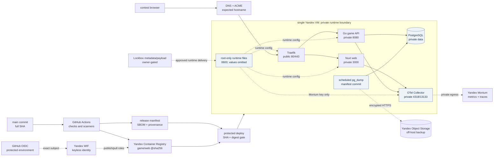

# Production infrastructure: architecture and evidence

Снимок документа: `2026-08-01`. Это non-secret architecture/evidence index,
а не подтверждение, что cloud, VM, DNS, GitHub settings или production URL уже
работают. Capability считается live только после соответствующего owner-approved
read-only/mutation evidence.

## Trust and data-flow diagram



Solid arrows represent application/data flow. Dashed arrows represent
identity, deployment or secret-delivery control flow. The dashed edges do not
grant permission by themselves: WIF, Lockbox, DNS/NS, host bootstrap and
deploy are separate gates. PostgreSQL, Docker socket/API, OTLP, telemetry
storage and management ports remain private. The browser must never receive a
credential, raw event, hand/deck order, database value or internal game state.

## Why a modular monolith

The game API is one deployable Go service with explicit modules for HTTP
transport, application transactions, persistence and the pure deterministic
engine. The Nuxt web image, PostgreSQL, Collector and Traefik remain separate
runtime boundaries because they have different failure, privacy and scaling
properties. This keeps actor authority, idempotency, migration ordering and
replay in one transaction boundary while avoiding a premature broker or service
mesh. A multi-VPS or managed-database split is a future architecture change,
not an implied property of this single-VM contest topology.

## Evidence matrix

| Capability | Repository evidence | Current boundary |
|---|---|---|
| Authoritative game, actor-specific projection and version invalidation | `docs/agents/ARCHITECTURE.md`, backend tests, archived game plans | Local engine/application evidence; no public game session is claimed here |
| Readiness and one-shot migrations | [readiness runbook](../operations/READINESS_MIGRATIONS_AND_OTEL.md), archived [backend readiness plan](../agents/plans/archive/20260731T005306Z-fb49f6-backend-readiness-and-opentelemetry.md) | Local tests/checks passed; production migration and public smoke unrun |
| Production Compose, Traefik and controlled deploy boundary | [deployment runbook](../operations/PRODUCTION_DEPLOYMENT.md), archived [Compose/deploy plan](../agents/plans/archive/20260731T005306Z-3de45e-production-compose-traefik-and-deploy.md) | Digest-pinned desired state and static checks passed; VM/bootstrap/DNS/TLS/deploy unrun |
| OTel privacy path, dashboard and alerts | [observability runbook](../operations/OBSERVABILITY.md), archived [telemetry plan](../agents/plans/archive/20260731T005307Z-54ac2f-telemetry-backend-dashboards-and-alerts.md) | Collector/dashboard/alert contracts are local; Monium import, trace query and 60-minute soak unrun |
| Off-host backup and isolated restore | [backup runbook](../operations/POSTGRES_BACKUP_AND_RESTORE.md), archived [backup plan](../agents/plans/archive/20260731T005307Z-5662b5-postgres-object-storage-backup-and-restore.md) | Scripts/Terraform/static checks passed; bucket mutation, first backup and restore drill unrun |
| Security and supply chain | [security](../operations/PRODUCTION_SECURITY.md), [supply chain](../operations/SUPPLY_CHAIN.md), archived [security plan](../agents/plans/archive/20260731T005308Z-3beea1-production-security-and-supply-chain.md) | Local contracts, pins, static audit and canonical verify passed; live GitHub/WIF/registry/host evidence unrun |
| Production URL and contest flow | [five-minute demo](../demo/CONTEST_DEMO.md) | `munchkin.l1ttl3h0rse.ru` is an expected hostname only; valid HTTPS smoke is not recorded |

The archived plans are the durable evidence index. Their completed acceptance
items distinguish repository-side implementation from explicitly unrun cloud,
host, secret, paid or destructive gates. This document does not upgrade an
unrun gate into a capability claim.

## Canonical operator runbooks

| Operation | Canonical source | Stop condition |
|---|---|---|
| First deploy, migration order, readiness and ACME | [PRODUCTION_DEPLOYMENT.md](../operations/PRODUCTION_DEPLOYMENT.md) | Missing exact SHA/digests, secret modes, host key, approval or smoke |
| Failed migration | [READINESS_MIGRATIONS_AND_OTEL.md](../operations/READINESS_MIGRATIONS_AND_OTEL.md) and deployment runbook | Do not start new application containers; preserve the failed evidence |
| Rollback | [PRODUCTION_ROLLBACK.md](../operations/PRODUCTION_ROLLBACK.md) | Previous pair lacks compatible `health-migrations-v1` evidence |
| Reboot recovery | Deployment runbook, `scripts/production/status.sh` | Missing data-disk mount, Docker/systemd recovery or readiness |
| DNS/TLS | Deployment runbook, [Yandex bootstrap](../operations/YANDEX_CLOUD_TERRAFORM_BOOTSTRAP.md) | No separate NS/DNS/ACME approval or invalid certificate chain |
| WIF revoke and recovery | [GITHUB_ACTIONS_YANDEX_IMAGES.md](../operations/GITHUB_ACTIONS_YANDEX_IMAGES.md), security runbook | Claim mismatch or suspected publisher compromise; stop publication |
| Secret rotation | [PRODUCTION_SECRETS.md](../operations/PRODUCTION_SECRETS.md) | Value appears in Git, plan, state, output, artifact or log |
| Telemetry outage and alerts | [OBSERVABILITY.md](../operations/OBSERVABILITY.md) | Never let an alert authorize deploy, migration, DNS or destructive action |
| Backup and isolated restore | [POSTGRES_BACKUP_AND_RESTORE.md](../operations/POSTGRES_BACKUP_AND_RESTORE.md) | Production DSN/data, unapproved object mutation or non-disposable target |

The index links to procedures instead of copying commands. This avoids a
second, drifting deploy or recovery source of truth.

## Local evidence commands

Run from the repository root with credentials removed from the process:

```bash
./leinoctl verify --changed
node .codex/hooks/plan-lint.mjs
bash scripts/ci/security-scan.sh --contract
node scripts/ci/verify-action-pins.mjs
bash scripts/production/security-audit.sh
bash scripts/terraform-check.sh
docker compose --parallel 8 -f compose.production.yml config --quiet
```

These commands validate repository contracts/configuration. They do not publish
images, exchange WIF credentials, mutate Terraform, write Lockbox, change DNS,
bootstrap a VM, send an alert email or delete a registry object. The canonical
verifier is the lifecycle gate; its output must be recorded in the selected
plan before that plan is archived.

## Explicit limitations

- One VM is the documented topology; HA, managed PostgreSQL, WAF, SIEM and
  public telemetry management are not promised.
- The production URL, valid certificate, release SHA, image digests, dashboard
  query and backup freshness become public claims only after fresh sanitized
  evidence is recorded.
- The five-minute demo is live-only. A screenshot may supplement fresh evidence
  after privacy review; a prerecorded video cannot substitute for the live path.
- Secrets, owner email, personal IP/CIDR, private host keys and raw database or
  game data never belong in README, plans, screenshots, artifacts or logs.
